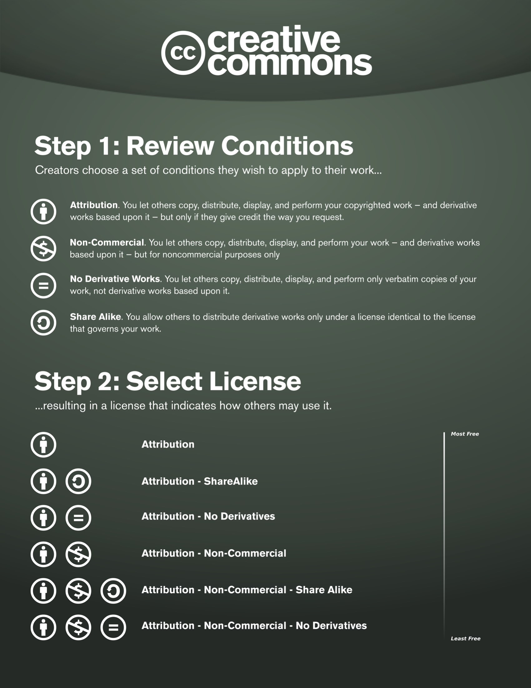

  
## Licensing copyrighted work
Licences are **contractual agreements** between the 
copyright owner/s and user/s limiting how the work can be used. 

[Examples of licences](https://www.jisc.ac.uk/guides/copyright-law/licences) are:

- [Jisc Model Licence](https://subscriptionsmanager.jisc.ac.uk/about/jisc-model-licence)
- Copyright owners can be represented by a collecting society who
negotiates licenses with users, e.g. (Spotify)[https://www.spotify.com/uk/legal/spotify-for-artists-terms-and-conditions/], [CLA](https://www.cla.co.uk)
- [Creative Commons](https://creativecommons.org/share-your-work/cclicenses/)

Creative Works where a copyright owner is unknown or untraceable are known
as **Orphan Works**. Guidance on how to deal with this cases is available from the
[UK government](https://www.gov.uk/guidance/copyright-orphan-works).

#Open educational resources (OERs, e.g. usually Creative Commons)
#Orphan works

## Creative Commons Licenses (CC)

Creative Commons licenses are a **standardised way to grant copyright permissions** 
to creative work by individuals, 
organisations and institutions.

They  help creators to **retain copyright** 
while allowing others to **copy, distribute, and make some uses** 
of their work.

They are designed to be easy to use and understand by stating
in simple terms what the user is allowed to do, and under
which conditions.

They all have common **features** which serve as baseline. 
On top of which licensors can choose to grant additional permissions.

{alt='CC license'}

:::::::::: keypoints
## Using copyrighted work

To use a **creative work** protected by copyright 
it is generally advised:

1. Once you have found a **creative work** you would like
to use, you will need to determine the type of usage:
  - If it is not digitised, will you be producing
  a digital version?
  - Would you like to remix/change it? if so, Are you willing 
  to release the resulting **creative work** for further remixes?
  - Would you be using it for commercial purposes?
2. Understand the license which is currently offered with
the creative work and its restrictions.
3. If no license is available then find the owner of the copyright. 
Remember in many cases it might not be who holds the content.
4. If you are using the **creative work** for educational purposes,
confirm that your intended use falls within the exceptions to copyright.
5. If you require a license, agree with the owner one. Favour
the Creative Commons suite of licenses.
6. Ensure you attribute the **creative work** when making use of it.

::::::::::

